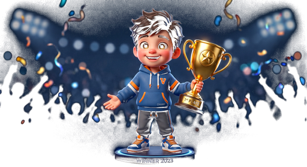

# 🚀 QuizBaaz 3D - Gamified Flutter Quiz & Learning Platform

<div align="center">



### **A Next-Gen 3D Gamified Quiz Platform built with Flutter**
*Chapter-Wise Question Bank • Daily 10-Question Live Quiz • Live Leaderboard • Yesterday's Champion Gifts • 3D Streaks • Zero-Friction Guest Trial • Central Admin Panel*

[](https://flutter.dev)
[](https://dart.dev)
[](LICENSE)
[](https://github.com/Keshab1997/quizbaaz-flutter)

</div>

---

## 🌟 Key Highlights & Features

1. **🎨 Glassmorphism & Neon Glow Dark UI:**
   - Futuristic Navy Blue + Purple Gradient aesthetic with realistic glossy glassmorphism cards and neon glowing borders.
2. **🏆 Daily 10-Question Competitive Quiz:**
   - 10 fresh questions every single day with real-time countdown timer, speed-based bonus scoring, and anti-cheat mechanisms.
3. **🥇 Yesterday's Champion & Real Gifts Tracker:**
   - Everyone on the home screen sees who won yesterday (#1 Podium with 3D trophy), their score, and what reward/gift they won (Smartwatch, Voucher, Cash).
4. **🔥 3D Daily Streak Fire Flame:**
   - Motivating daily streak system with interactive fire animations and weekly milestone rewards.
5. **📚 Chapter-wise JSON Question Bank:**
   - Modular JSON-driven question banks organized by Categories and Chapters (General Science, Tech, History, Geography, Math, etc.).
6. **🚪 Zero-Friction Guest Trial Onboarding:**
   - Visitors can explore the dashboard and play trial quizzes immediately without forced registration, boosting user acquisition.
7. **🛡️ Dynamic Admin Web Control Panel:**
   - Bulk JSON/Excel question uploader, Daily Quiz scheduler, Yesterday's Winner dispatcher, and Gift courier tracker.

---

## 📂 Documentation Directory (`/docs`)

All architectural and step-by-step blueprints are documented in the [`docs/`](./docs) folder:

* 📄 **[`01_PROJECT_ROADMAP.md`](./docs/01_PROJECT_ROADMAP.md)**: Complete Architecture, Tech Stack, and Folder Structure.
* 🖥️ **[`02_ALL_PAGES_AND_SCREENS.md`](./docs/02_ALL_PAGES_AND_SCREENS.md)**: Specifications for all 9 main screens and interactive modals.
* 🗄️ **[`03_JSON_DATA_SCHEMAS.md`](./docs/03_JSON_DATA_SCHEMAS.md)**: JSON Schemas for Chapter questions, Daily Quiz, Leaderboards, and Rewards.
* 🚀 **[`04_PHASE_WISE_EXECUTION_PLAN.md`](./docs/04_PHASE_WISE_EXECUTION_PLAN.md)**: Phase-by-phase implementation checklist (Phase 1 to Phase 7).
* 🛡️ **[`05_ADMIN_PANEL_AND_BACKEND_SPEC.md`](./docs/05_ADMIN_PANEL_AND_BACKEND_SPEC.md)**: Admin Web Dashboard and Backend REST API Design.
* 👤 **[`06_USER_AUTHENTICATION_AND_GUEST_TRIAL_FLOW.md`](./docs/06_USER_AUTHENTICATION_AND_GUEST_TRIAL_FLOW.md)**: Guest Visitor Onboarding & 1-Tap Account Upgrade.

---

## 🏗️ Project Architecture

```text
quizbaaz-flutter/
├── assets/
│   ├── data/                   # JSON Question Banks, Champions & Daily Quiz
│   ├── icons/                  # 3D Glossy Action Icons (Streak Fire, Sword, Shop, etc.)
│   └── images/
│       ├── avatars/            # 3D Player Profile Avatars
│       └── characters/         # 3D Hero & Champion Characters
│
├── docs/                       # Comprehensive Architecture & Step-by-Step Plans
│
├── lib/
│   ├── core/
│   │   ├── constants/          # App Colors, Theme, Asset Paths, Strings
│   │   └── theme/              # Glassmorphism & Neon Glow Theme Configuration
│   ├── data/
│   │   ├── models/             # Question, Chapter, Champion, User, Leaderboard Models
│   │   └── providers/          # Quiz, User, Auth, and Leaderboard Providers
│   └── presentation/
│       ├── screens/            # Dashboard, Daily Quiz, Chapters, Leaderboard, Admin, etc.
│       └── widgets/            # Reusable GlassCard, NeonButton, StreakFlame, Podium
│
└── pubspec.yaml
```

---

## 📱 Tech Stack & Packages

* **Frontend Framework:** Flutter 3.x (Dart 3.x)
* **State Management:** Provider / Riverpod
* **Typography:** Google Fonts (`Poppins`, `Hind Siliguri`)
* **Visual Effects:** Custom Backdrop Filters, Dual Gradients, Box Shadows
* **Animations:** Lottie, Custom Matrix4 Transformations
* **Audio & Feedback:** `audioplayers`, `haptic_feedback`
* **Local Persistence:** `shared_preferences`

---

## 👨‍💻 Author

* **Developer:** Keshab Sarkar ([@Keshab1997](https://github.com/Keshab1997))
* **Repository:** [https://github.com/Keshab1997/quizbaaz-flutter](https://github.com/Keshab1997/quizbaaz-flutter)
